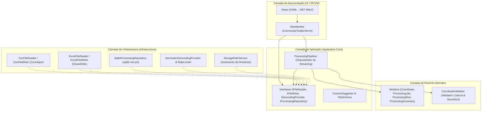

# Manual Técnico — IoT Lat/Lon Processor

O **IoT Lat/Lon Processor** é uma aplicação desktop de alta performance desenvolvida em **.NET 10 MAUI (Windows)**, projetada para leitura, validação, enriquecimento geográfico (reverse geocoding) e persistência de arquivos tabulares em larga escala (CSV e Excel XLSX).

Este manual destina-se a engenheiros de software, arquitetos, desenvolvedores mantenedores e equipes de DevOps que necessitem compreender a arquitetura interna, o modelo de execução, os esquemas de dados, os procedimentos de compilação e as diretrizes de extensão do sistema.

---

## 1. Visão Arquitetural

O projeto foi concebido sob os princípios da **Clean Architecture** e do modelo **Local-First**, separando estritamente regras de domínio, orquestração de casos de uso, infraestrutura de I/O / rede e camadas visuais.

### 1.1 Diagrama de Camadas



### 1.2 Princípios Arquiteturais Fundamentais

1. **Local-First & Privacidade Estrita:** Dados tabulares, históricos e metadados de execução nunca saem do computador do usuário. Apenas a tupla matemática `(latitude, longitude)` é despachada via HTTPS para o serviço de mapas.
2. **Streaming & Baixo Consumo de Memória:** O pipeline não carrega arquivos gigantescos (ex.: 500.000 linhas) integralmente na memória RAM. A leitura e escrita ocorrem via cursores de streaming com processamento em blocos (*chunks*).
3. **Resiliência a Falhas & Checkpointing:** O estado de execução é persistido de forma transacional no SQLite e em disco a cada lote configurável de linhas (padrão: 100 linhas). O cancelamento ou encerramento abrupto permite retomada posterior sem perda de progresso.
4. **Respeito Estrito à Política de Rate Limit:** Para integração com o OpenStreetMap Nominatim, o sistema implementa controle de taxa de requisições rígido ($\le 1$ req/s, concorrência = 1), fila sequencial, detecção de HTTP 429 (`Retry-After`) e *exponential backoff* com *jitter*.
5. **Deduplicação & Cache Hierárquico:** Evita requisições repetidas consultando primeiro o cache em memória do lote atual e, em seguida, a base histórica persistida em SQLite.

---

## 2. Estrutura da Solução e Código-Fonte

A solução é organizada sob a pasta raiz do repositório em:

```text
IoT-lat-lon-processor/
├── src/
│   └── IoT-lat-lon-processor/           # Projeto Principal (.NET MAUI Windows)
│       ├── Application/                  # Casos de uso, orquestração e contratos
│       │   ├── Pipeline/                 # ProcessingPipeline.cs
│       │   ├── Services/                 # Interfaces de IO, Geocoding e Repositório
│       │   └── Models/                   # DTOs de schema e sugestão de colunas
│       ├── Domain/                       # Entidades e regras puras de negócio
│       │   ├── Models/                   # Coordinate, ProcessingJob, ProcessingRow, etc.
│       │   └── Services/                 # CoordinateValidator (regras e heurísticas)
│       ├── Infrastructure/               # Implementações concretas de tecnologia
│       │   ├── Configuration/            # Classes de binding do appsettings.json
│       │   ├── Geocoding/                # NominatimGeocodingProvider e RateLimiter
│       │   ├── IO/                       # Leitores e escritores CSV/XLSX
│       │   ├── Persistence/              # SQLite DB Context e Repositório
│       │   └── Storage/                  # StoragePathService
│       ├── Presentation/                 # Camada gráfica MVVM
│       │   ├── ViewModels/               # ViewModels reativos
│       │   └── Views/                    # Telas XAML
│       ├── App.xaml / AppShell.xaml      # Inicialização e roteamento Shell
│       ├── MauiProgram.cs                # Composition Root (Injeção de Dependências)
│       └── appsettings.json              # Configurações externas da aplicação
├── tests/
│   └── IoT-lat-lon-processor.Tests/      # Testes de Unidade e Integração (xUnit)
│       ├── Domain/                       # Testes de validação de coordenadas
│       ├── Pipeline/                     # Testes de streaming, deduplicação e cancelamento
│       ├── Geocoding/                    # Testes de rate limit e cache
│       ├── IO/                           # Testes de leitura e escrita CSV/Excel
│       └── Persistence/                  # Testes do repositório SQLite
├── docs/                                 # Documentação de usuário e técnica
├── harness/                              # Casos de teste formais e cenários
└── artifacts/                            # Binários compilados e artefatos de release
```

---

## 3. Detalhamento dos Componentes e Módulos

### 3.1 Camada de Domínio (`Domain`)

A camada de domínio é livre de dependências de infraestrutura, bancos de dados ou bibliotecas gráficas.

* **`Coordinate`:** Struct imutável contendo `Latitude` (double) e `Longitude` (double). Possui método `GetCacheKey(int precision = 6)` que gera uma representação canônica textual formatada com precisão configurável (ex.: `"-23.550520,-46.633308"`).
* **`CoordinateValidationResult`:** Objeto de valor contendo flags booleanas (`IsValid`, `HasProbableSwap`, `IsAmbiguous`), enum `LatitudeValidity` / `LongitudeValidity` e mensagem detalhada de diagnóstico.
* **`CoordinateValidator` (`ICoordinateValidator`):** Implementa o parser universal e heurístico de coordenadas:
  * Suporta formatos decimais com vírgula ou ponto (`-23,5505` ou `-23.5505`).
  * Remove caracteres invisíveis (BOM, espaços não separáveis, tabulações).
  * Converte sufixos e prefixos cardeais internacionais e lusófonos: `N`, `S`, `E`, `W`, `L` (Leste), `O` (Oeste).
  * **Heurística de Inversão:** Quando o valor fornecido como Latitude extrapola o limite $[-90, 90]$ mas pertence ao intervalo de Longitude $[-180, 180]$, e o valor fornecido como Longitude cabe no intervalo $[-90, 90]$, o validador sinaliza `HasProbableSwap = true`.
  * **Heurística de Ambiguidade:** Quando ambos os valores cabem no intervalo de Latitude $[-90, 90]$ (ex.: coordenadas no Brasil como `-23.55` e `-46.63`), o sistema sinaliza `IsAmbiguous = true`, exigindo confirmação explícita do usuário e **proibindo inversão automática silenciosa**.

### 3.2 Camada de Aplicação (`Application`)

Responsável pela orquestração do fluxo de trabalho sem acoplamento direto com tecnologias de terceiros.

* **`ProcessingPipeline`:** Orquestrador central que executa as seguintes etapas assíncronas:
  1. Criação do trabalho (`ProcessingJob`) com status `Running`.
  2. Inicialização dos diretórios de armazenamento (`input`, `output`, `logs`, `state`).
  3. Cópia preventiva do arquivo original para o diretório de entrada do lote.
  4. Leitura em streaming do arquivo de entrada linha por linha através da interface `IFileReader`.
  5. Resolução de coordenadas com fluxo otimizado:
     * Validação sintática e de intervalo via `ICoordinateValidator`.
     * Se coordenada inválida: marcação como `InvalidCoordinate` e geração de log de erro de linha.
     * Se coordenada válida: verificação no cache local em memória (deduplicação intra-arquivo); se ausente, verificação no cache persistido SQLite; se ausente, envio ao `IGeocodingProvider`.
  6. Gravação atômica em lotes (*batch*) no repositório SQLite a cada $N$ linhas.
  7. Atualização contínua de métricas através de eventos `ProgressChanged` disparados para a UI.
  8. Monitoramento cooperativo do `CancellationToken` para parada suave e segura.
  9. Ao término, emissão do arquivo enriquecido através de `IFileWriter` e geração de log estruturado `processamento.jsonl`.
* **`ColumnSuggester`:** Analisa os cabeçalhos do arquivo utilizando correspondência exata, pontuação por similaridade de strings e expressões regulares para sugerir os melhores candidatos para Latitude e Longitude, bem como determinar o nome apropriado da coluna de endereço (evitando conflitos).

### 3.3 Camada de Infraestrutura (`Infrastructure`)

#### A. Leitura e Escrita Tabular (`Infrastructure/IO`)
* **`CsvFileReader` / `CsvFileWriter`:** Utiliza a biblioteca `CsvHelper`. Implementa detecção automática de delimitadores (`;`, `,`, `\t`, `|`) e leitura orientada a streaming (`GetRecordsAsync`), processando arquivos gigantescos com pegada de memória constante. Suporta escrita com preservação de todas as colunas originais acrescidas da coluna `Endereço`.
* **`ExcelFileReader` / `ExcelFileWriter`:** Utiliza `ClosedXML`. Permite inspeção de todas as abas (*worksheets*), leitura linha a linha e escrita preservando os tipos e formatos das células originais.

#### B. Provedor de Geocodificação e Rate Limiting (`Infrastructure/Geocoding`)
* **`RateLimiter`:** Componente de sincronização thread-safe baseado em `SemaphoreSlim(1, 1)` e cronômetro de precisão (`Stopwatch`). Garante intervalo mínimo obrigatório (padrão: 1100 ms) entre disparos sucessivos de requisições, prevenindo condições de corrida e bloqueio de IP.
* **`NominatimGeocodingProvider`:**
  * Utiliza `HttpClient` injetado via fábrica.
  * Monta a requisição para `/reverse?format=jsonv2&lat={lat}&lon={lon}&addressdetails=1`.
  * Aplica *User-Agent* obrigatório com dados de contato válidos conforme exigido pela política de uso do OpenStreetMap.
  * Captura cabeçalhos de resposta HTTP 429 (*Too Many Requests*) e interpreta o cabeçalho `Retry-After`.
  * Executa tentativas automáticas (*retries*) com *exponential backoff* e *jitter* aleatório para erros transitórios (ex.: HTTP 500, 502, 503, 504 e `TaskCanceledException`/timeouts).
  * Monta a string final de endereço a partir de campos estruturados (`road`, `house_number`, `suburb`, `city`/`town`, `state`, `postcode`, `country`) com fallback para `display_name`.

#### C. Persistência de Dados (`Infrastructure/Persistence`)
Implementada sobre SQLite utilizando `sqlite-net-pcl` com operações 100% assíncronas:
* **Banco de Dados:** Arquivo `iot_lat_lon_processor.db` localizado no diretório de dados da aplicação (`AppData/Local/IoT-lat-lon-processor/`).
* **Tabelas Relacionais:**
  * `ProcessingJobs`: Metadados do lote (ID, caminho original, delimitador, colunas mapeadas, status, data de início/fim, métricas agregadas).
  * `ProcessingRows`: Estado individual de cada linha (JobId, número da linha, latitude/longitude originais e normalizadas, status de resolução, endereço resultante, código de erro).
  * `CoordinateCacheEntries`: Tabela global de cache de coordenadas indexada por `CacheKey`, permitindo que pesquisas feitas em lotes passados acelerem lotes futuros.
  * `JobCheckpoints`: Ponto de restauração com o índice da última linha processada com sucesso.

---

## 4. Esquema do Banco de Dados SQLite

```sql
CREATE TABLE IF NOT EXISTS ProcessingJobs (
    Id TEXT PRIMARY KEY,
    OriginalFilePath TEXT NOT NULL,
    ProcessedFilePath TEXT,
    FileFormat TEXT NOT NULL,
    SelectedSheet TEXT,
    Delimiter TEXT,
    LatitudeColumnName TEXT NOT NULL,
    LongitudeColumnName TEXT NOT NULL,
    AddressColumnName TEXT NOT NULL,
    IsSwapped INTEGER NOT NULL,
    TotalRows INTEGER NOT NULL,
    ProcessedRows INTEGER NOT NULL,
    SuccessfulRows INTEGER NOT NULL,
    NotFoundRows INTEGER NOT NULL,
    ErrorRows INTEGER NOT NULL,
    CachedRows INTEGER NOT NULL,
    HttpRequestsCount INTEGER NOT NULL,
    Status TEXT NOT NULL,
    ErrorMessage TEXT,
    CreatedAt TEXT NOT NULL,
    StartedAt TEXT,
    FinishedAt TEXT
);

CREATE TABLE IF NOT EXISTS ProcessingRows (
    Id INTEGER PRIMARY KEY AUTOINCREMENT,
    JobId TEXT NOT NULL,
    SourceRowNumber INTEGER NOT NULL,
    RawLatitude TEXT,
    RawLongitude TEXT,
    ParsedLatitude REAL,
    ParsedLongitude REAL,
    Status TEXT NOT NULL,
    ResolvedAddress TEXT,
    ErrorMessage TEXT,
    IsFromCache INTEGER NOT NULL,
    ProcessedAt TEXT NOT NULL
);

CREATE UNIQUE INDEX IF NOT EXISTS IX_ProcessingRows_Job_Row 
ON ProcessingRows (JobId, SourceRowNumber);

CREATE TABLE IF NOT EXISTS CoordinateCacheEntries (
    CacheKey TEXT PRIMARY KEY,
    Latitude REAL NOT NULL,
    Longitude REAL NOT NULL,
    ResolvedAddress TEXT,
    Status TEXT NOT NULL,
    CreatedAt TEXT NOT NULL,
    LastAccessedAt TEXT NOT NULL
);

CREATE TABLE IF NOT EXISTS JobCheckpoints (
    JobId TEXT PRIMARY KEY,
    LastProcessedRowNumber INTEGER NOT NULL,
    UpdatedAt TEXT NOT NULL,
    CheckpointDataJson TEXT
);
```

---

## 5. Estrutura de Diretórios de Execução e Armazenamento

Todos os dados gerados em tempo de execução são alocados no diretório padrão do usuário do Windows:

```text
%LOCALAPPDATA%\IoT-lat-lon-processor\
├── iot_lat_lon_processor.db           # Banco de dados local SQLite
├── iot_lat_lon_processor.db-shm       # Arquivo de controle de memória compartilhada
├── iot_lat_lon_processor.db-wal       # Write-Ahead Log do SQLite
└── Processamentos\
    └── {AAAA}\
        └── {MM}\
            └── {JobId}\
                ├── input\
                │   └── arquivo_original.csv
                ├── output\
                │   └── arquivo_processado_com_enderecos.csv
                ├── logs\
                │   └── processamento.jsonl
                └── state\
                    └── checkpoint.json
```

### Formato do Log Estruturado (`processamento.jsonl`)

Cada linha do arquivo de log é um documento JSON independente, permitindo ingestão direta por ferramentas de observabilidade (Elasticsearch, Datadog, Splunk ou scripts de auditoria):

```json
{"timestamp":"2026-09-05T18:00:00.1234567-03:00","level":"INFO","event":"PipelineStarted","jobId":"a1b2c3d4","totalRows":1000}
{"timestamp":"2026-09-05T18:00:01.2345678-03:00","level":"WARN","event":"RowInvalid","jobId":"a1b2c3d4","row":15,"reason":"InvalidLatitudeRange"}
{"timestamp":"2026-09-05T18:00:10.5555555-03:00","level":"INFO","event":"CheckpointSaved","jobId":"a1b2c3d4","processedRows":100}
{"timestamp":"2026-09-05T18:05:00.9999999-03:00","level":"INFO","event":"PipelineCompleted","jobId":"a1b2c3d4","status":"Completed","metrics":{"total":1000,"success":980,"cached":150,"errors":20}}
```

---

## 6. Configurações (`appsettings.json`)

O arquivo de configuração reside junto ao executável e permite customizações operacionais sem necessidade de recompilação do código-fonte:

```json
{
  "Geocoding": {
    "Provider": "Nominatim",
    "BaseUrl": "https://nominatim.openstreetmap.org",
    "UserAgent": "IoT-lat-lon-processor/1.0 (contact: developer.g2toys@gmail.com)",
    "RateLimitMs": 1100,
    "MaxConcurrency": 1,
    "TimeoutSeconds": 30,
    "MaxRetries": 3,
    "RetryInitialDelayMs": 1000,
    "CoordinatePrecisionDigits": 6
  },
  "Pipeline": {
    "BatchSize": 100,
    "ProgressReportIntervalMs": 250,
    "EnableMemoryDeduplication": true,
    "EnablePersistentCache": true
  },
  "Storage": {
    "RetainInputCopy": true,
    "GenerateStructuredJsonLog": true
  }
}
```

---

## 7. Procedimento de Compilação, Testes e Publicação

### 7.1 Pré-requisitos
* Windows 10 (19041+) ou Windows 11 x64.
* **.NET 10 SDK** (versão `10.0.301` ou superior instalada).
* Carga de trabalho (*workload*) MAUI instalada:
  ```powershell
  dotnet workload install maui-windows
  ```

### 7.2 Compilação e Verificação de Código
Para compilar a solução em modo de desenvolvimento:
```powershell
dotnet build IoT-lat-lon-processor.sln -c Debug
```

### 7.3 Execução dos Testes Automatizados
O projeto conta com uma suíte abrangente de 55 testes cobrindo parsing cultural, heurísticas de inversão e ambiguidade, rate limiting, streaming, deduplicação e persistência:
```powershell
dotnet test tests/IoT-lat-lon-processor.Tests/IoT-lat-lon-processor.Tests.csproj -c Debug
```

### 7.4 Publicação Standalone (Single-File Self-Contained)
Para gerar o executável final autossuficiente para Windows x64 (que não requer pré-instalação de runtime ou dependências externas no cliente):

```powershell
dotnet publish src/IoT-lat-lon-processor/IoT-lat-lon-processor.csproj `
  -c Release `
  -r win-x64 `
  -f net10.0-windows10.0.19041.0 `
  --self-contained true `
  -p:PublishSingleFile=true `
  -p:IncludeNativeLibrariesForSelfExtract=true `
  -o artifacts/publish/win-x64
```

Os artefatos gerados na pasta de publicação incluem:
* `IoT-lat-lon-processor.exe`: Executável único contendo todo o runtime do .NET 10, bibliotecas nativas e a aplicação.
* `appsettings.json`: Arquivo de configuração editável pelo usuário/administrador.
* `IoT-lat-lon-processor.pdb`: Símbolos de depuração para análise de falhas em produção.

---

## 8. Guia de Extensão e Manutenção

### 8.1 Adicionando um Novo Provedor de Geocodificação

O sistema foi arquitetado em torno do padrão de inversão de dependência. Para plugar um novo provedor (ex.: Google Maps Geocoding API, HERE Maps, Mapbox ou instância privada do Nominatim):

1. **Implementar a Interface `IGeocodingProvider`:**
   ```csharp
   namespace IoT_lat_lon_processor.Application.Services;

   public class CustomGeocodingProvider : IGeocodingProvider
   {
       private readonly HttpClient _httpClient;
       private readonly RateLimiter _rateLimiter;

       public CustomGeocodingProvider(HttpClient httpClient, RateLimiter rateLimiter)
       {
           _httpClient = httpClient;
           _rateLimiter = rateLimiter;
       }

       public async Task<GeocodingResult> ReverseGeocodeAsync(
           double latitude, 
           double longitude, 
           CancellationToken cancellationToken = default)
       {
           await _rateLimiter.WaitForTurnAsync(cancellationToken);
           
           // Executar requisição HTTP conforme especificação do novo serviço
           // Retornar GeocodingResult com status Resolved, NotFound ou Error
       }
   }
   ```
2. **Registrar o Provedor no Container de Injeção de Dependências:**
   Em `src/IoT-lat-lon-processor/MauiProgram.cs`, vincule a nova classe conforme o valor de `appsettings.json` ou registre-a condicionalmente.

### 8.2 Adicionando Suporte a Novos Formatos de Entrada/Saída

Para suportar novos formatos tabulares (como Apache Parquet, GeoJSON ou SQLite externo):
1. Crie uma classe que implemente `IFileReader` em `Infrastructure/IO/`.
2. Crie uma classe que implemente `IFileWriter` em `Infrastructure/IO/`.
3. Registre as implementações na fábrica de leitores/escritores do pipeline.

---

## 9. Tratamento de Erros e Códigos de Status

| Código/Status | Descrição | Ação do Pipeline |
|---|---|---|
| `Pending` | Linha ainda não processada. | Permanece na fila de streaming. |
| `Resolved` | Endereço localizado com sucesso. | Adiciona o texto na coluna `Endereço` e salva no cache. |
| `NotFound` | Coordenada válida sem endereço correspondente no mapa (ex.: em alto-mar). | Coluna `Endereço` vazia, contabilizada nas métricas de "Não Encontrados". |
| `InvalidCoordinate` | Texto com formato numérico inválido ou fora dos limites permitidos. | Linha ignorada para requisição HTTP; coluna `Endereço` vazia; erro registrado em log. |
| `NetworkError` | Falha persistente de conexão ou timeout após esgotadas as tentativas. | Contabilizado nas métricas de erro; permite reprocessamento posterior. |
| `Cancelled` | Execução interrompida por solicitação do usuário. | Salva checkpoint imediato no SQLite e interrompe o pipeline de forma limpa. |
